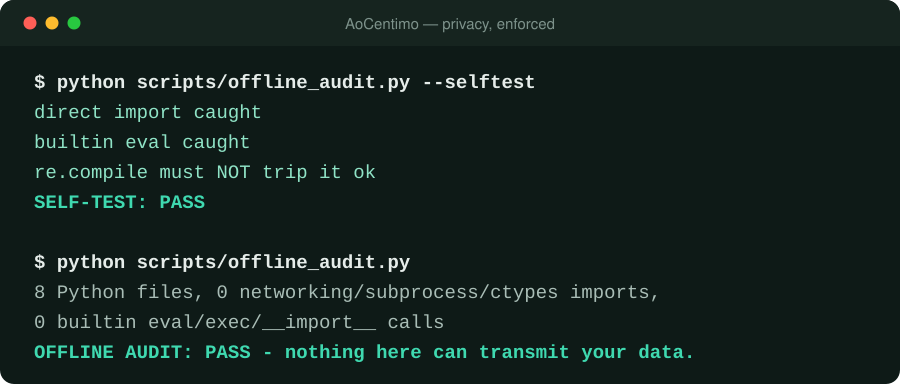
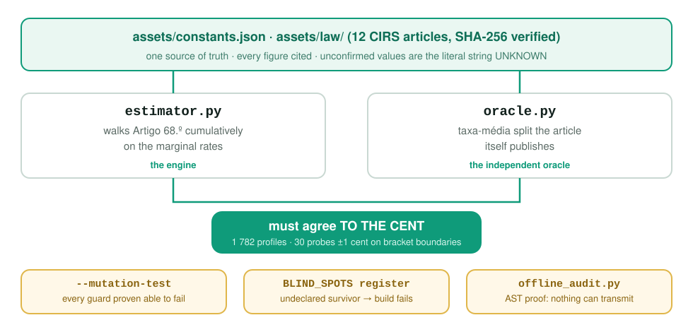

<p align="center">
  <picture>
    <source media="(prefers-color-scheme: dark)" srcset="https://raw.githubusercontent.com/yeer0s/AoCentimo/main/docs/images/aocentimo-wide-dark-1k.svg">
    
  </picture>
</p>

<p align="center">
  <a href="https://github.com/yeer0s/AoCentimo/actions/workflows/gates.yml"></a>
  <a href="LICENSE"></a>
  
  
  
  <a href="https://mowei.pt"></a>
  <a href="https://buymeacoffee.com/letsmoweis"></a>
  <a href="https://ko-fi.com/letsmowei"></a>
</p>

<h3 align="center">
  O seu IRS, ao cêntimo.<br>
  Offline. Determinístico.<br>
  Recusa-se a adivinhar.
</h3>

<p align="center">
  <b>Um motor de IRS offline e determinístico para agentes de IA.</b><br>
  Doze artigos do Código do IRS capturados literalmente · dois motores independentes<br>
  cruzados ao cêntimo · uma bateria de testes construída para falhar.<br>
  <sub><a href="README.md">🇬🇧 Read in English</a></sub>
</p>

---

:fire: ***Novidades*** :fire:

- **[Jul 2026]** Primeira versão pública — nove defeitos fiscais encontrados e corrigidos, três deles por um modelo adversarial
- **[Jul 2026]** Arquitetura de dois motores: `estimator.py` e `oracle.py` têm de concordar **ao cêntimo** em 1 782 perfis de rendimento
- **[Jul 2026]** Testes de mutação — cada guarda tem de ser provado capaz de *falhar* antes de o seu verde ser acreditado
- **[Jul 2026]** Art. 68.º-A capturado, depois de se descobrir que o endpoint do limite global vinha **do artigo errado** em quatro anos de rendimento
- **[Jul 2026]** Anos de rendimento 2022-2025, cada um calculado contra a lei tal como estava nesse ano

---

## O seu IRS não é da conta de nenhuma API

Todos os "assistentes fiscais com IA" têm a mesma arquitetura: escreve o seu salário, a
idade dos seus filhos, a sua renda, as suas despesas de saúde — e a ferramenta envia tudo
isso para o servidor de outra pessoa.

**Esta não tem caminho no código que o pudesse fazer.**

<p align="center">
  
</p>

- **Zero chamadas de rede.** Sem chaves de API, sem telemetria. O
  `scripts/offline_audit.py` analisa cada ficheiro distribuído e falha perante qualquer
  import de rede, `subprocess` ou `ctypes`, e perante qualquer `eval`/`exec` nativo. O CI
  ainda corre **todos os gates com a camada de sockets desativada** — se alguma coisa
  tentasse ligar-se ao exterior, o build rebentava.
- **A lei viaja com o código.** Doze artigos do CIRS em `assets/law/`, cada um com um
  SHA-256 que a bateria reverifica. Desligue o cabo de rede; continua a calcular.
- **Corre num modelo local.** Ollama, llama.cpp, LM Studio, uma máquina isolada. O seu
  NIF, o seu salário e as suas despesas médicas nunca saem da máquina.
- **Estrutural, não prometida.** Uma política de privacidade é a intenção de uma empresa;
  isto é uma arquitetura sem qualquer caminho de import ou de chamada para a rede. Com
  precisão: a auditoria é uma *verificação estática, não uma sandbox* — apanha o
  acidental e o óbvio, e não é defesa contra um contribuidor malicioso determinado. Esse
  risco é gerido lendo cada PR, não pela AST. Ver [SECURITY.md](SECURITY.md).

## Instalação

```bash
git clone https://github.com/yeer0s/AoCentimo.git
cp -r AoCentimo ~/.claude/skills/portugal-irs     # Claude Code / Claude Desktop
```

Sem `pip install`. Sem `requirements.txt`. Biblioteca padrão do Python 3.10+ e mais nada.

## Verifique você mesmo, em 30 segundos

```bash
cd AoCentimo
python scripts/estimator.py --selftest       # 19 golden + 9 retro + guarda de recusa
python scripts/oracle.py --crosscheck        # dois motores, ao cêntimo, 1782 perfis
python scripts/oracle.py --mutation-test     # provar que os guardas conseguem falhar
python scripts/offline_audit.py --selftest   # provar que a auditoria de privacidade falha
python scripts/sweep.py                      # 46 verificações
```

Todos saem com `0`. Experimente com o Wi-Fi desligado.


## O que faz

| Tarefa | O que obtém |
|---|---|
| **Estimar** | A liquidação completa — rendimento coletável → coleta → deduções → apuramento — para 2022-2025, cada ano na sua própria lei |
| **Recuperar** | Recalcular uma declaração entregue, quantificar o que ficou por deduzir, e obter o instrumento de correção *e o prazo* — declaração de substituição, reclamação graciosa, a janela de dois anos do art. 140.º |
| **Maximizar** | [27 linhas de deduções](assets/deduction-matrix.json) com limites, mecânica do e-Fatura, [25 entendimentos da AT](assets/doutrina-index.json), e os casos-fronteira que decidem os difíceis |
| **Organizar** | [61 códigos de campo do Modelo 3](assets/field-codes.json), 8 erros plantados, checklist de documentos, e as [divergências](assets/divergence-cases.json) que resultam do campo errado |

Cobre escalões, quociente conjugal, conjunta vs separada, IRS Jovem, recibos verdes /
categoria B simplificado, mínimo de existência, adicional de solidariedade, dependentes e
ascendentes com todas as majorações, PPR, rendas, saúde, educação, despesas gerais
familiares, e o limite global com a majoração para famílias numerosas.

## Porque confiar nesta

A maior parte do código fiscal é validada contra casos escritos por quem escreveu o
código, a partir da leitura que essa pessoa fez da lei. **Isso deteta alterações e é
estruturalmente cego a um erro partilhado.**

O nosso esteve cego a um durante um ano. A tabela de escalões de 2025 tinha as taxas que a
**Lei n.º 55-A/2025 revogou — enquanto citava essa mesma lei como base legal.** Os 19 casos
concordavam com a tabela errada. Todos os gates estavam verdes. Todas as estimativas
estavam €48 a €401 por ano acima do devido.

<p align="center">
  
</p>

| Garantia | Como é imposta |
|---|---|
| **Dois motores, ao cêntimo** | `estimator.py` percorre o art. 68.º cumulativamente pelas taxas marginais; `oracle.py` usa a divisão por taxa média que o próprio artigo publica. 1 782 perfis, 30 sondas a ±1 cêntimo sobre os limites dos escalões |
| **Guardas provados capazes de falhar** | O `--mutation-test` injeta cada defeito que um guarda diz apanhar. O que sobreviver tem de estar **declarado** num registo de pontos cegos — e uma entrada declarada que passe a ser detetável *também* faz falhar, para o registo nunca virar alibi |
| **Recusa em vez de adivinhar** | Qualquer constante não confirmada é a string `UNKNOWN` e o motor **levanta exceção**. Provado por um teste-guarda, não afirmado aqui |
| **Cada lacuna tem direção** | 16 aproximações declaradas, cada uma dizendo se sobrestima ou subestima o imposto. A bateria falha se alguma não tiver direção |

Há um ponto cego declarado e real: o 9.º escalão é aberto, logo o art. 68.º não publica
taxa média para ele e nada consegue cruzar-verificar a taxa de 48%. Está escrito em
público em vez de escondido.

## ⚠️ Não é aconselhamento financeiro, fiscal ou jurídico

**Estimativas produzidas a partir de legislação pública. Não é um parecer profissional e
não cria qualquer relação profissional. Todos os valores, recomendações e documentos aqui
produzidos têm de ser verificados por um contabilista certificado (OCC) ou outro
profissional qualificado antes de entregar, assinar, pagar ou agir com base neles.**

Termos completos: **[DISCLAIMER.md](DISCLAIMER.md)**.

Apenas a [Autoridade Tributária](https://info.portaldasfinancas.gov.pt) e o Diário da
República são autoritativos. As capturas offline da lei degradam-se a cada Orçamento do
Estado. Uma calculadora não pode assinar o seu Modelo 3, não o pode representar perante a
AT, e não tem seguro de responsabilidade profissional — um [OCC](https://www.occ.pt/) faz
as três coisas. **Isto existe para o tornar um cliente melhor preparado, não um cliente
inexistente.** Não é aceite qualquer responsabilidade por imposto liquidado, coimas,
deduções perdidas ou decisões tomadas com base nos resultados.

## Gratuito, e vai continuar

Licença MIT. Sem versão paga, sem versão "pro", sem muro de email, sem telemetria.

Feito por **[mowei.pt](https://mowei.pt)** — ferramentas de comparação gratuitas e guias em
português simples para **energia, telecomunicações, seguros, banca, crédito e apoios**. Se
isto lhe encontrou dinheiro no IRS, é provável que o mesmo agregado esteja a pagar a mais
numa tarifa qualquer.

<p align="center">
  <a href="https://mowei.pt"></a>
</p>

<p align="center">
  <a href="https://mowei.pt"><b>&#127477;&#127481; mowei.pt &mdash; ferramentas gratuitas</b></a>
  &nbsp;&middot;&nbsp;
  <a href="https://buymeacoffee.com/letsmoweis"></a>
  &nbsp;&middot;&nbsp;
  <a href="https://ko-fi.com/letsmowei"></a>
</p>

O apoio é totalmente opcional e sempre será — o projeto está completo sem ele.

## Contribuir

Por ordem de valor:

1. **[Um número errado](../../issues/new?template=wrong-number.yml)** — uma taxa, limite,
   patamar ou coeficiente que contradiga o artigo que cita. A coisa mais valiosa que
   alguém pode enviar.
2. **Estender o `oracle.py` aos anos 2022-2024** — esses casos retro estão em caminho
   único e dizem-no.
3. **O taper do art. 70.º n.º 3**, se conseguir a fórmula simplificada publicada pela AT.
4. **Anexo G / Anexo J** — as duas maiores lacunas de cobertura.

Todos os PRs têm de manter os gates a sair com `0`, e cada constante nova precisa da sua
citação.

## Licença

[MIT](LICENSE) — use, faça fork, distribua comercialmente. Um link de volta para
[mowei.pt](https://mowei.pt) é apreciado, nunca exigido.
